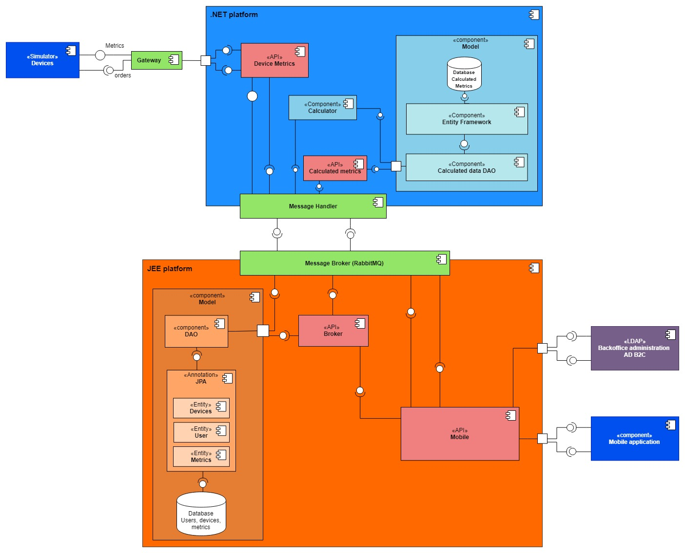

# Atlantis Project

This scholar project's goal was to create an Ionic application to see and manage devices and users. 
A dedvice can measure temperature, pressure, light... 

## Atlantis application structure
```
.
└── Home
    └── Hub
        ├── User-devices
        │   └── Device-details
        │       └── Display-graph
        ├── [A] Associate-devices
        │   └── Select-devices
        └── [A] List-users
            └── List-user-devices
                └── Device-details
```

## Install application
```
>npm install
>ionic serve [--devapp]
```

`--devapp` allows you to see the application on a phone, using [Ionic Devapp](https://play.google.com/store/apps/details?id=io.ionic.devapp&hl=fr) application.

*There initially was a .NET and JEE platform during the project but I decided to delete them, as I did not do it*


<!-- 
#Home
##Hub
###User-devices
####Device-details
#####Display-graph
###[A] Associate-devices
####Select-devices
###[A] List-users
####List-user-devices
#####Device-details

Name: Ascii Tree Generator
Description: A VS Code extension to generate ascii tree of directories or formatting selected text to tree strings.
VS Marketplace Link: https://marketplace.visualstudio.com/items?itemName=aprilandjan.ascii-tree-generator
-->